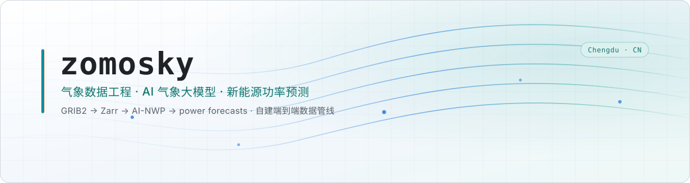
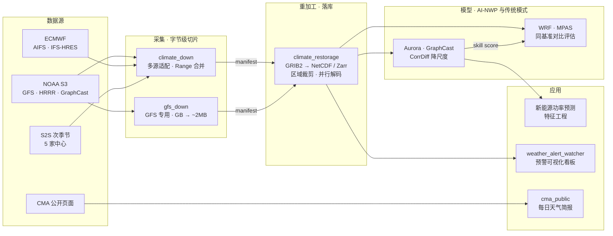

<div align="center">

<picture>
  <source media="(prefers-color-scheme: dark)" srcset="assets/header-dark.svg">
  <source media="(prefers-color-scheme: light)" srcset="assets/header-light.svg">
  
</picture>

<br/>

[](https://github.com/zomosky)
[](https://github.com/zomosky?tab=followers)
[](https://github.com/zomosky?tab=repositories)
[](https://github.com/zomosky)

</div>

---

## `$ neofetch`

<div align="center">

<picture>
  <source media="(prefers-color-scheme: dark)" srcset="assets/terminal-dark.svg">
  <source media="(prefers-color-scheme: light)" srcset="assets/terminal-light.svg">
  
</picture>

</div>

数值天气预报的工程化落地，是我大部分时间在做的事：从 NOAA / ECMWF 的公开对象存储里按字节切下需要的变量，重加工成可直接建模的 Zarr / NetCDF；一端接 AI 气象大模型的推理与评估，另一端喂给新能源功率预测与电力市场研究。

- 🛰️ **气象数据工程** — GRIB2 字节级切片、多源适配、Zarr 分块存储、管线编排
- 🤖 **AI 气象大模型** — Aurora / GraphCast / CorrDiff 的落地与评估，与 WRF / MPAS 传统模式做同基准对比；关注降尺度、集合与误差结构
- ⚡ **新能源与电力** — 光伏/风电功率预测的特征工程，电力现货价格预测方向的探索
- 🧰 **工程习惯** — Python 3.11+、`uv`、pydantic v2 校验、pytest 覆盖、结构化日志、Docker 化交付
- 🎨 **顺手造的轮子** — 科研配图与 PPT 的配色体系（[anime-palettes](https://github.com/zomosky/anime-palettes)），过了色盲可分性评级

---

## `$ cat ~/.config/stack.toml`

<div align="center">

**核心语言与科学计算**


**气象 / 地学数据**


**AI 气象大模型 / 深度学习**


**工程与基础设施**


**开发工具链**


</div>

---

## `$ pipeline --graph`

我的仓库不是零散的练习，它们是同一条流水线上的相邻工序 —— 从公网数据源到可建模数据集，再到模型评估与业务产品。



> `manifest` 是这条管线里的契约：上游下载完成即产出清单，下游据此幂等触发，两端可独立部署、独立重跑。

---

## `$ ls -l ~/projects`

<table>
<tr>
<td width="50%" valign="top">

### 🛰️ [climate_down](https://github.com/zomosky/climate_down)
多源数值预报下载管线。可插拔适配器覆盖 **AIFS / IFS-HRES / GFS / HRRR / GraphCast / S2S**，YAML 驱动作业，Range 请求智能合并，下载阶段即完成变量与字节级过滤。

`Python 3.11` `httpx` `pydantic v2` `cfgrib` `structlog` · Apache-2.0

</td>
<td width="50%" valign="top">

### 📦 [climate_restorage](https://github.com/zomosky/climate_restorage)
逐时次 GRIB2 → 单文件 NetCDF / Zarr。区域裁剪、按预报步拼接、变量重命名，多进程并行解码约 4× 提速，磁盘态幂等调度可直接挂 cron。

`xarray` `cfgrib` `zarr` `pytest ×30` · Apache-2.0

</td>
</tr>
<tr>
<td width="50%" valign="top">

### ⚡ [gfs_down](https://github.com/zomosky/gfs_down)
GFS 专用切片下载器。HTTP Range 变量级切片把数 GB 预报文件压到 ~2MB（**约 99.97% 带宽节省**），双层进度追踪、指数退避重试、断点续传。

`Python 3.12` `cfgrib` `cartopy` · Apache-2.0

</td>
<td width="50%" valign="top">

### 🌪️ [weather_alert_watcher](https://github.com/zomosky/weather_alert_watcher)
全国极端天气预警看板。省级风险地图（离线 GeoJSON）、7 天温湿曲线、30 分钟自动刷新，数据源可切换 NMC / 和风 / Open-Meteo。

`Vue + Vite` `FastAPI` `PostgreSQL` `Redis` `Docker Compose`

</td>
</tr>
<tr>
<td width="50%" valign="top">

### 🎨 [anime-palettes](https://github.com/zomosky/anime-palettes)
面向科研配图与 PPT 的 58 组配色库。CIELAB 空间下调整明度饱和度以保留角色色相，按色盲可分性 A–C 评级，输出 HTML 色卡 / Python 模块 / xlsx / `.ase` / `.gpl`。

`零依赖 Python 模块` `4 种排序模式` `连续 colormap` · MIT

</td>
<td width="50%" valign="top">

### 📰 [cma_public](https://github.com/zomosky/cma_public)
中国气象局公开页面聚合，生成每日 Markdown 天气简报并支持 SMTP 分发。模型不可用时自动降级，配置分公共默认 / 本地覆盖 / 环境变量三层。

`Python 3.11` `web scraping` `LLM 摘要` `SMTP`

</td>
</tr>
</table>

---

## `$ gh stats --user zomosky`

<div align="center">

<picture>
  <source media="(prefers-color-scheme: dark)" srcset="https://github-readme-stats.vercel.app/api?username=zomosky&show_icons=true&include_all_commits=true&count_private=true&hide_border=true&theme=dark&bg_color=0b0f14&title_color=39d3bb&icon_color=58a6ff&text_color=c9d1d9&cache_seconds=86400">
  
</picture>
<picture>
  <source media="(prefers-color-scheme: dark)" srcset="https://github-readme-stats.vercel.app/api/top-langs/?username=zomosky&layout=compact&langs_count=8&hide_border=true&theme=dark&bg_color=0b0f14&title_color=39d3bb&text_color=c9d1d9&cache_seconds=86400">
  
</picture>

<br/><br/>

<picture>
  <source media="(prefers-color-scheme: dark)" srcset="https://github-readme-activity-graph.vercel.app/graph?username=zomosky&theme=github-compact&hide_border=true&bg_color=0b0f14&color=39d3bb&line=58a6ff&point=f0883e&area=true">
  
</picture>

<br/><br/>

<picture>
  <source media="(prefers-color-scheme: dark)" srcset="https://raw.githubusercontent.com/zomosky/zomosky/output/github-snake-dark.svg">
  <source media="(prefers-color-scheme: light)" srcset="https://raw.githubusercontent.com/zomosky/zomosky/output/github-snake.svg">
  
</picture>

</div>

---

## `$ cat ~/now.md`

```console
[*] AI 气象大模型横向评测：Aurora / GraphCast / CorrDiff vs WRF / MPAS
    同一套检验框架下的技巧评分与误差结构
[*] 气象数据管线存储层向对象存储演进，统一多源数据的分块与访问方式
[*] 光伏功率预测辐射类特征工程：ssrd / fdir / ssrdc / tisr
[*] 电力现货市场价格预测调研：节点电价、出清价格
[*] 面向算法侧 + 业务侧的数值模式与气象预报知识课程
```

---

## `$ curl -s zomosky/contact`

```json
{
  "github":   "https://github.com/zomosky",
  "location": "Chengdu, China (UTC+8)",
  "response": "slow, but always read",
  "contact":  "open an issue, or use the address on my GitHub profile"
}
```

<div align="center">

[](https://github.com/zomosky)

<sub>💭 回复可能会慢一些，但每条都会看。</sub>

</div>
